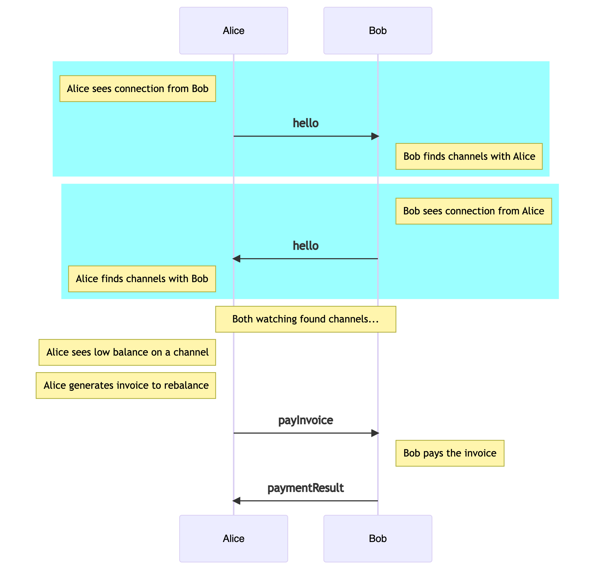

# Blocktank - Tightrope

Tightrope can automatically rebalance channels within a cluster of Lightning Network nodes using distributed peer-to-peer communication over [Hyperswarm](https://github.com/hyperswarm/hyperswarm).

## ⚠️ Warning

This is pre-alpha software. Please use at your own risk. Expect breaking changes on minor releases.

## Usage

Before you start, copy `config/default.json` to `config/local.json` and edit the copy. See below for details.

Once you config is set up, just...

```
npm install
node src
```

## What does Tightrope do?

Each instance of Tightrope can be given API credentials of many Lightning nodes. Tightrope will find all the channels between these Lightning nodes and keep an eye on them. When they drift too far out of balance, Tightrope will ask the poorer side of the channel to generate an invoice to bring it back into balance. Tightrope will then pass this invoice to the richer side of the channel, asking for it to be paid. When paid, the channel is back in balance.

If parts of your cluster of Lightning nodes are managed by someone else, it might not be desirable for one party to provide the other with the API credentials for their set of Lightning nodes. Tightrope also solves this issue! Each party runs their own instance of Tightrope, with just their Lightning node credentials included. They share a secret that allows Tightrope to find the rest of the cluster of Lightning nodes using Hyperswarm, so channels that connect the two groups can also be kept in balance securely without either side needing to share API credentials with the other.

Example:

Alice has 2 lightning nodes (A and B). Each has many open channels, including 1 important channel between A and B that Alice wants to keep in balance to maintain liquidity between A and B. Alice sets up Tightrope, and adds the API credentials for A and B into the config. She also sets the secret in her Tightrope config to "correcthorsebatterystaple" (though please use a secure random password yourself). She starts Tightrope and it will automatically find the channel between A and B and keeps it in constant balance.

Bob also runs a cluster of Lightning nodes (C, D and E). He also needs to maintain liquidity between his nodes and uses Tightrope to do this. His config contains details of all three of this nodes along with his own secret password.

Alice and Bob agree that they would both benefit from a high capacity channel that links them (from A to C) and create it. Bob updates the secret in his Tightrope config to "correcthorsebatterystaple" and restarts Tightrope. Both clusters are now able to find each other and the channel between A and C is also kept in balance.

Later Bob opens a new channel between E and B. Tightrope automatically detects this change and will start maintaining this channel as well, without even needing to be restarted.

## How it works...

Tightrope first connects to all the Lightning nodes listed in the config file. For each node it starts a hyperswarm, following a topic derived from the secret in the config. This ensure that all other nodes in the cluster can find each other, and are able to talk securely over a peer-to-peer noise connection with each other.

Using the mechanism, Tightrope determines if any of the channels on a given node are actually channels to one of the other nodes in the cluster. If they are, it starts watching them. Whenever the channel is out of balance, an invoice is generated and sent to the peer that manages the Lightning node on the other side of the channel. Once validated, the invoice is paid, bringing the channel back into balance.

## Audit Logging

Tightrope also records events and transactions into an append-only log (A Hypercore). The logs provide a full history of events (such as peer discovery). The transaction log lists all payment attempts between nodes in the cluster and records their outcome.

## Settings

The following values can be configured in the settings files. default.json defines the default values. Override or replace them in local.json

* secret - this is the shared secret that the cluster will use. Pick a long and complex password
* lightningNodes - an array of lightning nodes to manage. For each node you will need to provide the following...
    * base64 encoded TLS Certificate
    * base64 encoded macaroon that has enough permissions to query channels, create and pay invoices
    * the GRPC Host of the lightning node
* audit - various settings about where to store the event and transactions logs (both Hypercores) and if verbose logging to the terminal is also required

The final section of the config gives you control over how nodes will rebalance between each other. You can provide default settings that apply to all nodes and channels, as well as overriding the settings for specific Lightning nodes, or individual channels if needed.

All the default values that will be used as a fallback for everything are listed in `limits.baseSettings`. Settings that override these base settings should be provided as an array in `limits.idSettings`. Each object in the array should include an `id` property and replacement values for any of the base settings. Valid id's are Lightning node alias names, channel id's and 'alias:channelId' for settings that are specific one side of the channel (a channel from Alice to Bob has the same channel id for them both, so 'Alice:channelId' will control the settings that Alice uses, and 'Bob:channelId' will control the settings that Bob uses).

Possible settings found in baseSettings, or each entry in idSettings are as follows:-

* maxTransactionSize - the max size, in tokens, of a single transaction
* minTimeBetweenPayments - The shortest possible time, in seconds, between each rebalancing payment being made.
* maxTransactionsPerPeriod - The max number of rebalancing payments made in each period
* maxTransactionsPeriod - The period used for the above limit
* maxAmountPerPeriod - The max amount that can be transacted (sum of all transactions) in each period
* maxAmountPeriod - The period used for the above limit
* balancePoint - Where should the balance point be for the funds in the channel. Defaults to 0.5
* deadzone - The size of the zone around the balance point in which no action is taken. Defaults to 0.1. With the defaults, the channels want to have 50% of their balance on each side (local and remote), but a rebalance will only occur if it drifts more than 10% away from this state (eg at 40% local, 60% remote).
* refreshRate - How often should Tightrope check the current balance of channels


## Messages Sent Between Peers...

Messages are sent peer-to-peer over an encrypted (noise) stream. Messages are also signed to ensure their validity.

#### `hello`

Data:
* publicKey: Lightning Node public Key
* alias: Lightning Node alias

Sent when a new peer on the HyperSwarm topic connects to us to tell them about our Lightning node. Each Lightning node being tracked in Tightrope will send a `hello` message each time a new connection is established and will recieve a `hello` message from the remote peer.

Eventually a node will have said `hello` to everyone in the swarm and received a `hello` from everyone in the swarm. This process allows Tightrope to build up a map of all the peers in the cluster that have an open channel with our Lightning node.

Any relevant channels in the cluster are then watched (typically by both sides) until they drift far enough out of balance to need a rebalancing payment to be made.


#### `payInvoice`

Data:
* invoice: Lightning Bolt 11 encoded invoice
* tokens: Amount to pay
* channelId: The channel id being rebalanced

When Tightrope discovers that a relevant channels local balance has fallen below some threshold, it will create an invoice to correct the situation and send its peer a `payInvoice` to ask for it to be paid. This channel will then be blocked from making another payment attempt for a while (configurable).

On receipt of the `payInvoice` message, Tightrope will validate the invoice payment and if everything is acceptable, pay it. Once the payment has been completed (or failed, or rejected), it sends a `paymentResults` message back to the peer that initiated the payment.

#### `paymentResult`

Data:
* channelId: Channel id being rebalanced
* paymentId: Payment id
* confirmed: true if the payment has been confirmed, false if not
* confirmedAt: An ISO 8601 formatted date time string

When a payment has completed, this message is sent back to the peer that asked to be paid, providing information about the payment.


